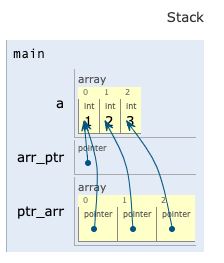

# C++: Array Pointers

### Code Example

Mixing pointer and array can be confusing in c++, here is a code example to differentiate types of array pointers.

```cpp
#include <iostream>

using namespace std;

int main()
{
    // create a simple array
    int a[3] = {1,2,3};
    
    // this is a pointer that points to a's address  
    int (*arr_ptr)[3]; 
    arr_ptr = &a;
    
    // this is an array of pointers that point to a[0], a[1], a[2]'s' address
    int *ptr_arr[3]; 
    ptr_arr[0] = &a[0];
    ptr_arr[1] = &a[1];
    ptr_arr[2] = &a[2];
    
    cout << "address of a: " << &a << endl;
    cout << "value of a: " << a << endl;
    cout << "address of a[0]: " << &a[0] << endl;
    cout << "value of a[0]: " << a[0] << endl;
    cout << "address of arr_ptr: " << &arr_ptr << endl;
    cout << "value of arr_ptr: " << arr_ptr << endl;
    cout << "address of ptr_arr: " << &ptr_arr << endl;
    cout << "value of ptr_arr: " << ptr_arr << endl;
    cout << "address of ptr_arr[0]: " << &ptr_arr[0] << endl;
    cout << "value of ptr_arr[0]: " << ptr_arr[0] << endl;

    return 0;
}
```

Output:

```cpp
address of a: 0xfff000bb4
value of a: 0xfff000bb4
address of a[0]: 0xfff000bb4
value of a[0]: 1
address of arr_ptr: 0xfff000ba8
value of arr_ptr: 0xfff000bb4
address of ptr_arr: 0xfff000bc0
value of ptr_arr: 0xfff000bc0
address of ptr_arr[0]: 0xfff000bc0
value of ptr_arr[0]: 0xfff000bb4
```

### Memory Visualization 



[Try yourself in C++ Tutor](http://pythontutor.com/cpp.html#code=%23include%20%3Ciostream%3E%0A%0Ausing%20namespace%20std%3B%0A%0Aint%20main%28%29%20%7B%0A%20%20%20%20int%20a%5B3%5D%20%3D%20%7B1,2,3%7D%3B%0A%20%20%20%20%0A%20%20%20%20//%20this%20is%20a%20pointer%20that%20points%20to%20a's%20address%20%20%0A%20%20%20%20int%20%28*arr_ptr%29%5B3%5D%3B%20%0A%20%20%20%20arr_ptr%20%3D%20%26a%3B%0A%20%20%20%20%0A%20%20%20%20//%20this%20is%20an%20array%20of%20pointers%20that%20point%20to%20a%5B0%5D,%20a%5B1%5D,%20a%5B2%5D's'%20address%0A%20%20%20%20int%20*ptr_arr%5B3%5D%3B%20%0A%20%20%20%20ptr_arr%5B0%5D%20%3D%20%26a%5B0%5D%3B%0A%20%20%20%20ptr_arr%5B1%5D%20%3D%20%26a%5B1%5D%3B%0A%20%20%20%20ptr_arr%5B2%5D%20%3D%20%26a%5B2%5D%3B%0A%20%20%20%20%0A%20%20%20%20cout%20%3C%3C%20%22address%20of%20a%3A%20%22%20%3C%3C%20%26a%20%3C%3C%20endl%3B%0A%20%20%20%20cout%20%3C%3C%20%22value%20of%20a%3A%20%22%20%3C%3C%20a%20%3C%3C%20endl%3B%0A%20%20%20%20cout%20%3C%3C%20%22address%20of%20a%5B0%5D%3A%20%22%20%3C%3C%20%26a%5B0%5D%20%3C%3C%20endl%3B%0A%20%20%20%20cout%20%3C%3C%20%22value%20of%20a%5B0%5D%3A%20%22%20%3C%3C%20a%5B0%5D%20%3C%3C%20endl%3B%0A%20%20%20%20cout%20%3C%3C%20%22address%20of%20arr_ptr%3A%20%22%20%3C%3C%20%26arr_ptr%20%3C%3C%20endl%3B%0A%20%20%20%20cout%20%3C%3C%20%22value%20of%20arr_ptr%3A%20%22%20%3C%3C%20arr_ptr%20%3C%3C%20endl%3B%0A%20%20%20%20cout%20%3C%3C%20%22address%20of%20ptr_arr%3A%20%22%20%3C%3C%20%26ptr_arr%20%3C%3C%20endl%3B%0A%20%20%20%20cout%20%3C%3C%20%22value%20of%20ptr_arr%3A%20%22%20%3C%3C%20ptr_arr%20%3C%3C%20endl%3B%0A%20%20%20%20cout%20%3C%3C%20%22address%20of%20ptr_arr%5B0%5D%3A%20%22%20%3C%3C%20%26ptr_arr%5B0%5D%20%3C%3C%20endl%3B%0A%20%20%20%20cout%20%3C%3C%20%22value%20of%20ptr_arr%5B0%5D%3A%20%22%20%3C%3C%20ptr_arr%5B0%5D%20%3C%3C%20endl%3B%0A%0A%20%20%20%20return%200%3B%0A%7D&curInstr=16&mode=display&origin=opt-frontend.js&py=cpp_g%2B%2B9.3.0&rawInputLstJSON=%5B%5D)


